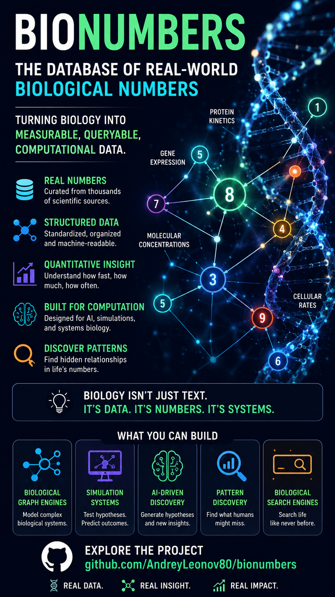

## 🧬 Introducing Bionumbers — a database of real-world biological numbers

What if biology wasn’t just descriptions…
but **measurable, queryable, computational data?**

I’ve been exploring and working with a simple but powerful idea:

> Biological systems can be treated as **numerical graphs of behavior**

And one of the most useful foundations for that is:

👉 [https://github.com/AndreyLeonov80/bionumbers](https://github.com/AndreyLeonov80/bionumbers)

---

## ⚙️ What this project is about

Bionumbers is a curated structure for:

* molecular and cellular measurements
* biological rates, concentrations, and scales
* system-level quantitative facts
* real experimental numbers from literature

Instead of reading biology as text, it becomes:

> 📊 a structured dataset of “how much”, “how fast”, “how often”

---

## 🧠 Why this matters

Most biological knowledge is currently:

❌ unstructured
❌ hard to compute over
❌ scattered across papers

This project pushes toward something different:

✔ machine-readable biology
✔ quantitative reasoning over life systems
✔ graph-based biological intelligence
✔ foundation for simulation & AI models

---

## 🔥 What you can build on top of it

With a structure like this, you can move toward:

* biological graph engines
* simulation systems
* AI-driven hypothesis generation
* pattern discovery in life systems
* “biological search engines” instead of static databases

---

## 🚀 Big idea

Instead of asking:

> “What does this gene do?”

We start asking:

> “What numerical behavior patterns does this system follow?”

That shift is what makes systems like Bionum Engine possible.

---

## 📎 Explore the project

👉 [https://github.com/AndreyLeonov80/bionumbers](https://github.com/AndreyLeonov80/bionumbers)

https://t.me/aidialog

https://x.com/aidialog

aidialog@mail.ru

| | |
| :---: | :---: |
|  |  |

