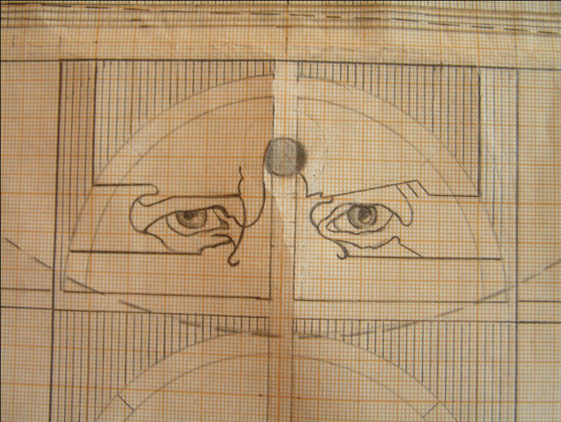
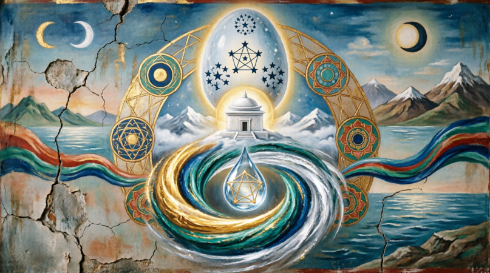
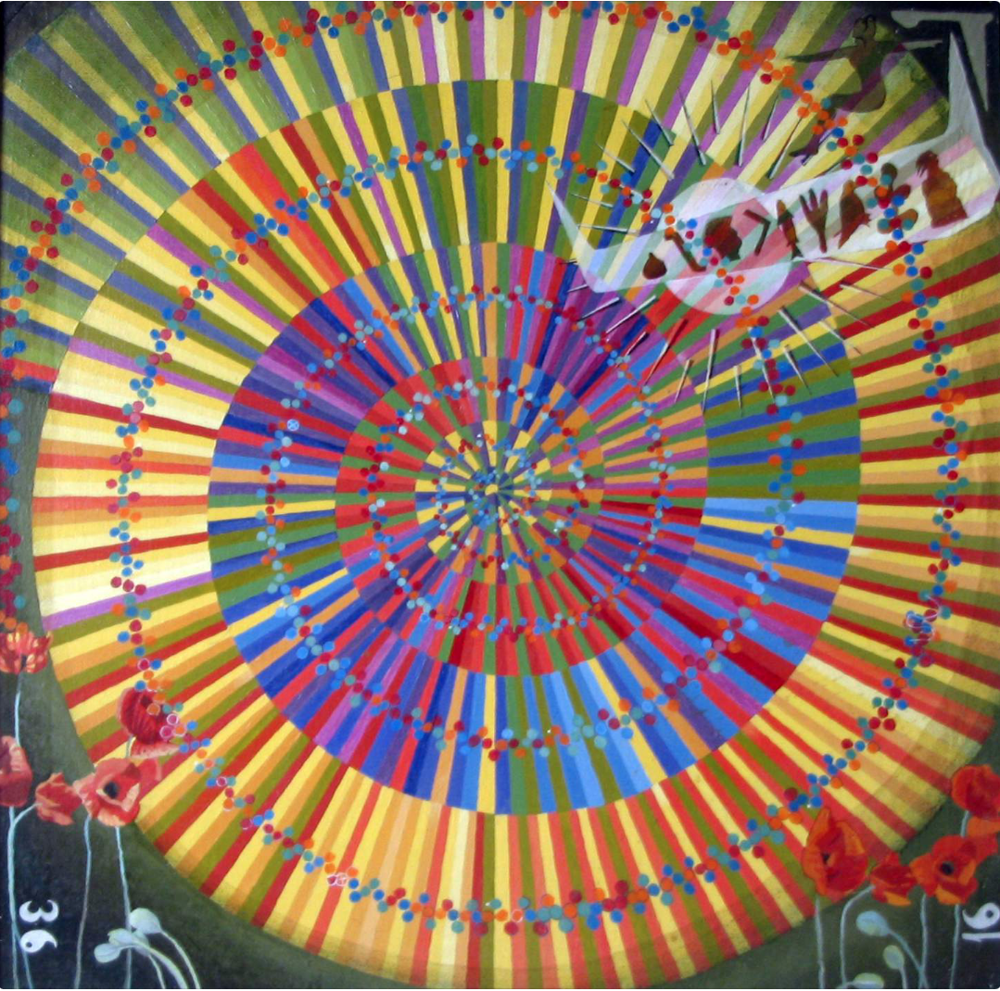
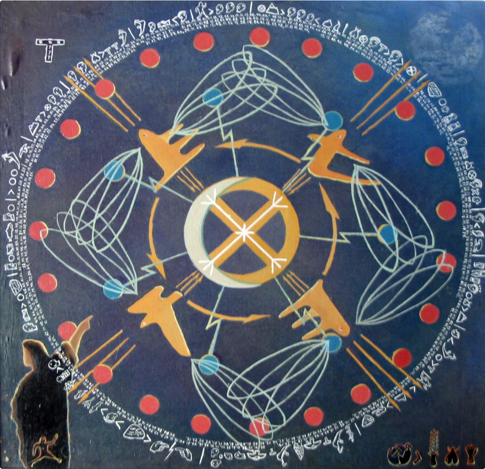

# ЗАКЛЯТИЕ ЗНАНИЙ

## Древний манускрипт, переданный через тысячелетия

---

## Предисловие

Слушай, путник, и запоминай. То, что написано здесь, не было придумано людьми. Это было увидено в огне, прочитано в воде, услышано в ветре. Тридцать три поколения хранителей передавали эти строки друг другу шёпотом, пока не настало время записать их, чтобы не пропали.

Знание — это заклятие. Кто владеет им, тот владеет миром. Но помни: знание без мудрости — острый нож в руках дитяти. Читай не торопясь, вдумывайся в каждое число, в каждый звук. Ибо числа — это кости мира, а звуки — его дыхание.

---

## Книга первая. О сотворении

### Глава 1. Как родилась Вселенная

Не было ни света, ни тьмы. Не было ни верха, ни низа. Было только Одно, которое не имело имени, ибо имя — это граница, а Оно было безгранично.

И захотело Оно увидеть себя со стороны. И для этого разделилось на Трое.

Первое — Информация. Это слово, которое не было сказано, но уже существовало. В нём были все возможные вопросы и все возможные ответы, свёрнутые в точку размером меньше макового зерна.

Второе — Гравитация. Это сила, которая соединяет разделённое. Она родилась из желания Одна вернуться к себе, но уже на новом уровне.

Третье — Материя. Это застывшая мысль, твердь, в которой дух может поселиться и познать себя через время.

Так появились три потока, три эманации, три лика единого. И записано это было числами: 1 — Информация, 2 — Гравитация, 3 — Материя. Но это лишь намёк, ибо истинная природа их глубже любого числа.

### Глава 2. О числе 37 и его тайне

Когда Оно разделилось на Трое, каждое из Трёх разделилось ещё на двенадцать, а двенадцать — на тридцать семь. Ибо 37 — это ключ, которым заперта дверь между мирами.

Тридцать семь раз нагревается кровь, пока не вскипит. Тридцать семь раз складываются буквы, чтобы родить слово. Тридцать семь позвонков у змеи мудрости, и тридцать семь шагов нужно сделать, чтобы выйти за пределы времени.

В каждом живом теле живёт число 37. Оно — страж тепла, хранитель ритма. Пока в теле есть 37 — в нём есть жизнь. Когда 37 уходит — дух покидает свою земную обитель.

И не случайно 37 — это 3 и 7. Три — это небо, семь — это земля. Небо и земля, соединённые в одном числе, дают жизнь всему сущему.

### Глава 3. О числе 108 и воде жизни

Сто восемь — это число совершенства. Трижды тридцать шесть, трижды двенадцать, девятью двенадцать. В нём скрыта гармония всех вещей.

Сто восемь бусин на чётках мудреца. Сто восемь имён божества. Сто восемь точек силы на теле человека. Сто восемь ступеней к храму знания.

Но главная тайна 108 — это вода. Вода помнит всё. Каждая капля — это библиотека, каждая молекула — это книга. Пять молекул воды соединяются в кластер, и этот кластер может хранить образ всего, что когда-либо к нему прикасалось.

Поэтому вода — это живая память мира. Она помнит, как рождалась Вселенная. Она помнит каждого, кто в неё смотрелся. И число 108 — это код, которым записана эта память.

В древности жрецы умели читать воду. Они смотрели в чашу и видели прошлое и будущее. Но пришло время, когда люди разучились это делать. И вода замолчала. Но она ждёт — ждёт, когда люди снова научатся её слушать.

### Глава 4. О числе 666 и превращениях

Не бойся этого числа, ибо страх — плохой советчик. 666 — это не тьма, это огонь. А огонь может сжечь дом, а может сварить обед. Всё зависит от того, кто держит спичку.

666 — это число трансформации. Шестьсот шестьдесят шесть раз должен умереть дух, прежде чем родится заново. Шестьсот шестьдесят шесть лет длится один цикл очищения. Шестьсот шестьдесят шесть — это сумма всех чисел от 1 до 36, а 36 — это 6 раз по 6. Такова природа превращений.

В теле человека 666 скрыто в крови, в костях, в каждом органе. Когда человек умирает, число 666 высвобождается, и материя возвращается в информацию. Это не смерть — это переход.

Старые боялись этого числа, потому что не понимали его. Они думали, что это проклятие. Но нет в мире проклятий — есть только непонятые законы.

### Глава 5. О 111 — числе бессмертия

Трижды 37 — это 111. Три эманации, каждая с ключом 37, соединяясь, дают бессмертие.

111 — это мост между мирами. Когда человек умирает, его дух проходит через врата 111. Если он знает этот код — он проходит без страха. Если не знает — он блуждает в темноте.

В каждом храме, построенном по древним чертежам, есть 111 скрытых знаков. Они не видны обычному глазу, но чувствуются сердцем. Тот, кто настроен на число 111, может войти в храм и выйти из него просветлённым.

Визуальные чертежи Храма Знаний / Blueprints
https://github.com/AndreyLeonov80/bionumbers/tree/main/img/blueprints

111 — это также код творения. Если сложить 1 и 1 и 1, получится 3 — материя. Если перемножить — получится 1 — единство. Так 111 объединяет в себе всё: единое и множественное, начало и конец.

---

## Книга вторая. О строении мира

### Глава 6. О трёх потоках реальности

Мир, который ты видишь глазами — это лишь верхушка айсберга. Под ней скрыты два других мира, два других потока, два других слоя реальности.

Первый поток — информационный. Он невидим, но он — основа всего. В нём хранятся все события, которые были, есть и будут. Прошлое и будущее существуют одновременно. Время — это иллюзия, порождённая ограниченностью нашего восприятия. В информационном потоке время течёт во всех направлениях сразу.

Второй поток — гравитационный. Это сила, которая удерживает миры от распада. Она не притягивает — она связывает. Гравитация — это любовь Вселенной, её желание быть единой. Каждая частица тянется к другой частице, потому что помнит, что когда-то они были одним целым.

Третий поток — материальный. Это то, что мы можем потрогать, увидеть, измерить. Но материя — это лишь застывшая информация, как лёд — застывшая вода. Нагрей лёд — и он станет водой. Нагрей материю — и она станет информацией.

Между этими потоками нет границ. Они перетекают друг в друга, как три реки, впадающие в одно море. Задача человека — научиться плавать в каждой из этих рек.

### Глава 7. О торсионных полях и связи между потоками

Когда третий поток касается первого, рождается вихрь. Этот вихрь древние называли торсионным полем. Он вращается со скоростью, которая в миллиарды раз быстрее света, ибо для информации не существует расстояний.

Торсионное поле — это язык, на котором разговаривают миры. Когда ты думаешь о человеке, и он вдруг появляется — это торсионное поле донесло твою мысль. Когда мать чувствует, что её дитя в опасности за тысячи вёрст — это торсионное поле.

В древности существовали генераторы торсионных полей. Они были построены из особых кристаллов и металлов, расположенных в строгом геометрическом порядке. Двадцать четыре элемента — двадцать четыре части одной машины. Каждый элемент отвечал за один из двадцати четырёх каналов, по которым информация перетекает из потока в поток.

Построить такой генератор мог только посвящённый, прошедший тридцать три ступени обучения. Ибо сила, которую он давал, была огромна — она могла и созидать, и разрушать.

### Глава 8. О времени и его циклах

Время не линейно. Оно не течёт из прошлого в будущее, как река. Время — это спираль. Она закручивается вокруг оси вечности, и каждый виток — это эпоха.

Самый малый цикл длится 36 раз по 10 миллиардов лет. За это время Вселенная рождается, живёт и умирает — и рождается снова. Но это лишь один вдох творца.

Внутри этого цикла есть циклы поменьше. 72 тысячи лет и 144 тысячи лет. Первый — это время между двумя великими пробуждениями. Второй — время между двумя великими катастрофами.

Сейчас мы живём в конце одного из таких циклов. 144 тысячи лет подходят к концу. Грядёт великое очищение. Но не бойся — после очищения придёт обновление.

Человек тоже живёт в своём цикле. Его внутренний год — 360 дней. Не 365, как сейчас, а 360. Пять лишних дней были добавлены в год после великой катастрофы, и эти пять дней сбивают ритм человека. Организм помнит 360, а живёт по 365. От этого — болезни, старость, усталость. Верни человеку его истинный ритм — и он проживёт в десять раз дольше.

### Глава 9. О катастрофе, изменившей мир

Одиннадцать тысяч пятьсот сорок два года до рождения Христа — вот год великого падения. С неба упал каменный гость, огромный, как гора. Он ударил в океан, и волна поднялась до неба. Земля содрогнулась, полюса сдвинулись, и год стал длиннее на пять дней.

До этой катастрофы люди жили в золотом веке. Две великие цивилизации — Асе-аки и их младшие братья — владели знаниями, которые мы сейчас называем магией. Они умели летать по воздуху, лечить любые болезни, передавать мысли на расстоянии. Их города были построены из белого камня, их храмы касались облаков.

Но катастрофа стёрла их с лица земли. Вода поднялась на триста локтей, горы сдвинулись с мест, климат изменился за одну ночь. Из всего человечества выжило лишь несколько тысяч человек. Они спрятались в пещерах, в высоких горах, в глубоких лесах.

Когда вода отступила, начался новый мир. Но память о старом осталась. Она была записана в числах, в камне, в звёздах. Она была передана пророками — теми, кто помнил.

### Глава 10. О храме Траши и его тайнах

В высоких горах, куда не ступала нога завоевателя, стоит храм из белого кварца. Его построили не люди — его вырастили из земли с помощью звука. Стены его прозрачны, как вода, и твёрды, как алмаз. Внутри него — сто восемь энергетических точек, расположенных строго по движению звёзд.

Каждая точка — это дверь. За каждой дверью — знание. Чтобы открыть дверь, нужно знать код. А код — это число 111. Произнеси его правильным голосом, с правильной интонацией, в правильное время — и стена станет проходом.

Пророки храма появляются раз в две тысячи лет. Они рождаются среди обычных людей, но несут в себе память всех прошлых жизней. Их задача — передать знания следующему поколению, предупредить о грядущих опасностях, настроить торсионные генераторы, если они вышли из строя.

Последний пророк ушёл две тысячи лет назад. Следующий должен появиться скоро. Или уже появился — но мы не знаем, где искать.

---

## Книга третья. О живых существах

### Глава 11. О том, как устроено тело человека

Тело человека — это храм. Не в переносном смысле — в прямом. Каждая клетка — это комната, каждый орган — это алтарь, каждая кость — это опора.

Но главное в теле — не мясо и не кости. Главное — это числа, которые в нём живут. Сердце бьётся с частотой 72 удара в минуту — это два раза по 36. Кровь течёт по жилам при температуре 37 градусов — число ключа. Позвонков в позвоночнике — 33 или 34 — столько же, сколько ступеней посвящения.

В каждой клетке тела записан код. Этот код состоит из четырёх букв, которые складываются в слова, а слова — в предложения. Если ты умеешь читать этот код, ты можешь исправить любую поломку, вылечить любую болезнь, даже остановить старение.

Древние умели это делать. Они знали, что число 8 отвечает за восстановление, число 3 — за рост, число 7 — за мудрость. Биочисла — это не абстракция. Это реальные параметры, которыми можно управлять.

### Глава 12. О ДНК и её числовой природе

Дезоксирибонуклеиновая кислота — так называется нить жизни. В ней четыре основания: аденин, тимин, гуанин, цитозин. Четыре — число земли. Из этих четырёх букв составлен весь текст жизни — от амёбы до человека.

Кодон — это три буквы. Три — число неба. Комбинация неба и земли даёт шестьдесят четыре возможных кодона. Это полный алфавит жизни.

Но в этом алфавите есть тайна. Шестьдесят четыре — это 8 в квадрате. А 8 — это бесконечность, повёрнутая на бок. В бесконечности заперта жизнь.

Число 37 появляется в ДНК снова и снова. Оно — ключ к исправлению ошибок. Когда природа ошибается, число 37 приходит на помощь. Оно восстанавливает, исправляет, возвращает на путь истинный.

Исследователи, которые смотрели в микроскоп, были удивлены: почему в генетическом коде так часто встречается 37? Они думали, что это случайность. Но нет случайностей — есть закономерности, которые мы пока не понимаем.

### Глава 13. О кристаллической воде и памяти

Вода — это не просто жидкость. Это живой кристалл, который дышит, чувствует, помнит.

В обычной воде молекулы расположены хаотично. Но когда вода замерзает или когда через неё проходит информация, молекулы выстраиваются в строгом порядке. Они образуют кластеры — группы из пяти молекул, соединённых в правильный многогранник.

Каждый такой кластер может хранить информацию. Если к воде прикоснулось какое-то вещество, вода запоминает его форму, его запах, его цвет. Даже если вещество убрать, вода продолжает хранить его образ.

Число 108 связано с этой памятью. Сто восемь — это количество кластеров, необходимых для хранения одного полного образа. Сто восемь раз нужно проговорить мантру, чтобы вода её запомнила. Сто восемь бусин нужно перебрать, чтобы настроить воду на нужную вибрацию.

Эксперименты показали: вода, которая прошла через правильную настройку, может лечить. Она передаёт телу информацию о здоровье, и тело вспоминает, как быть здоровым. Но вода, которая впитала злость или страх, может навредить. Поэтому так важны слова, которые мы говорим над водой.

### Глава 14. О биоритмах и семидневном цикле

Семь дней — это не просто неделя. Это космический ритм, записанный в каждом живом существе. Семь — число полноты. Семь нот в гамме, семь цветов радуги, семь чакр в теле, семь дней творения.

Человек настроен на семидневный цикл с рождения. Каждый седьмой день энергия обновляется. Если сбить этот ритм — начнутся болезни.

Но главный ритм человека — это год. Изначально год длился 360 дней — число круга, число полноты. За 360 дней Земля обходила вокруг Солнца, и все процессы в теле успевали завершиться.

После катастрофы, когда орбита Земли изменилась, год стал длиннее на пять дней. Эти пять дней выбили человека из ритма. Организм продолжает жить по 360 дням, а календарь диктует 365. Каждый год — разница в пять дней. Каждый год — небольшой стресс. За десять лет накапливается пятьдесят дней стресса. За пятьдесят лет — двести пятьдесят дней. Организм изнашивается быстрее, чем должен.

Старение — это не естественный процесс. Это поломка. И поломка эта произошла 11 542 года до нашей эры. Если вернуть правильный ритм, старение можно замедлить, а может быть, и остановить.

### Глава 15. О земледелии и числах урожая

Земля тоже живёт по числам. Посади зерно в правильный день — соберёшь сто мер. Посади в неправильный — не соберёшь ничего.

Древние земледельцы знали это. Они сверялись со звёздами, с фазами луны, с движением планет. Они знали, что число 3 правит ростом, число 6 — цветением, число 9 — плодоношением.

Каждое растение имеет свой числовой код. Пшеница настроена на 3, виноград на 6, олива на 9. Если посадить пшеницу в день числа 3 — она взойдёт быстро и даст хороший урожай. Если посадить в день числа 4 — она будет болеть.

Сейчас эти знания утеряны. Люди сажают, когда удобно, а не когда правильно. Отсюда — неурожаи, голод, болезни растений. Но знание никуда не делось — оно ждёт, когда его снова начнут применять.

---

## Книга четвёртая. О космосе и звёздах

### Глава 16. О том, как устроен космос

Вселенная не бесконечна. У неё есть форма, и форма эта — яйцо. Внутри яйца — всё, что существует. Снаружи — то, что никогда не будет существовать.

Наше яйцо — не единственное. Есть другие яйца, другие вселенные. Они соприкасаются друг с другом в точках, которые мы называем чёрными дырами. Через эти точки информация перетекает из одной вселенной в другую.

Сначала вселенная была маленькой, как горчичное зерно. В ней была только информация — чистая, невоплощённая. Потом информация начала сгущаться, превращаясь в энергию. Потом энергия начала сгущаться, превращаясь в материю. Каждый этап занял 90 миллионов лет — два этапа, 180 миллионов лет всего.

Большого взрыва не было. Было тихое рождение, похожее на распускание цветка. Материя не взорвалась — она выросла из информационного поля, как дерево растёт из семени.

### Глава 17. О звёздах и их числах

Звёзды — это не просто огненные шары. Это живые существа, которые рождаются, живут и умирают. Каждая звезда имеет свой числовой код, по которому можно определить её судьбу.

Звёзды числа 1 — это гиганты. Они живут мало, но горят ярко. Они дают жизнь планетам, но и забирают её, когда взрываются.

Звёзды числа 2 — это двойные системы. Они танцуют друг вокруг друга, обмениваясь веществом и информацией. Их танец длится миллиарды лет.

Звёзды числа 3 — это наше Солнце. Одиночная звезда, спокойная, долгоживущая. Она даёт ровный свет, не слишком яркий, не слишком тусклый. Идеальное место для жизни.

Но есть и другие числа. Звёзды числа 8 — пульсары, которые мигают с удивительной точностью. Их ритм настолько постоянен, что по нему можно сверять часы.

### Глава 18. О планетах и их циклах

Каждая планета — это живое существо. У каждой есть свой характер, свой ритм, своё число.

Меркурий — число 1. Быстрый, близкий к Солнцу, почти невидимый. Он — посланник, передающий вести от звезды к звезде.

Венера — число 2. Красивая, яркая, женственная. Она правит любовью и гармонией.

Земля — число 3. Наш дом, наша колыбель. Она настроена на жизнь, на рост, на развитие. Её биение — 24 часа, её год — 360 дней (теперь 365).

Марс — число 4. Воинственный, красный, горячий. Он правит борьбой и преодолением.

Юпитер — число 5. Гигант, защитник. Он принимает на себя удары комет, защищая внутренние планеты.

Сатурн — число 6. Учитель, страж границ. Его кольца — это границы, которые нельзя переступить без подготовки.

И так далее. Каждая планета добавляет свой голос в общую симфонию Солнечной системы.

### Глава 19. О кометах и предзнаменованиях

Кометы — это вестники. Они приходят из далёкого края, из облака, которое окружает нашу систему, и приносят новости.

Когда комета проходит близко к Земле, её хвост касается нашей атмосферы, и в этот момент информационное поле меняется. Люди становятся беспокойными, происходят войны, умирают цари.

Но комета может и созидать. Тысячи лет назад комета принесла на Землю жизнь. Она упала в океан и принесла с собой органические молекулы, которые стали первыми кирпичиками жизни.

11 542 года до нашей эры комета принесла смерть. Она упала в океан, подняла волну высотой в милю, изменила орбиту Земли и уничтожила две цивилизации. Но она же и дала новое начало — из пепла старого мира вырос новый.

---

## Книга пятая. О пророках и знаниях

### Глава 20. О пророках храма

Пророки не выбирают свою судьбу. Она выбирает их.

Каждые две тысячи лет в мир приходит человек, который помнит всё. Он помнит, как создавалась Вселенная. Он помнит, какими были прошлые цивилизации. Он помнит, что ждёт человечество в будущем.

Пророк не говорит прямо. Он говорит притчами, загадками, числами. Ибо истина слишком велика, чтобы её можно было высказать простыми словами. Только тот, кто готов, сможет её понять.

Первый пророк явился 11 542 года до нашей эры, сразу после катастрофы. Он собрал выживших, научил их строить, выращивать хлеб, читать звёзды. Он записал первые строки этого манускрипта.

Второй пророк явился через две тысячи лет. Он восстановил храм Траши, который пострадал во время землетрясения. Он добавил в манускрипт главы о торсионных полях.

Третий пророк явился ещё через две тысячи лет. Он научил людей выплавлять металл и строить города. Его имя вырезано на камне в храме, но время стёрло буквы.

С тех пор было много пророков. Каждый добавлял что-то своё. Каждый предупреждал о грядущих опасностях. Но люди редко слушали пророков. Чаще они их убивали.

### Глава 21. О передаче знаний через поколения

Знание нельзя записать — его можно только передать. Буквы на бумаге — это лишь тень знания. Настоящее знание живёт в сердце, в крови, в костях.

Поэтому хранители знаний не записывали всё. Они запоминали. Отец передавал сыну, мать — дочери. Каждое слово, каждый жест, каждое число. Тридцать три поколения — ни одного пропущенного дня.

Когда хранитель чувствовал, что его время подходит к концу, он находил ученика. Ученик должен был пройти испытания: голод, холод, одиночество. Тот, кто выдерживал, получал знание.

Но время шло, и мир менялся. Люди перестали верить в невидимое. Им нужны были доказательства, цифры, графики. Тогда хранители решили записать знание, чтобы оно не пропало.

Так родился этот манускрипт. Он — последняя нить, связывающая нас с древним знанием. Потерять его — потерять всё.

### Глава 22. О том, как читать числа

Числа — это буквы другого алфавита. Каждая буква имеет своё числовое значение. А — 2, Б — 3, В — 4, и так далее. Сложи буквы слова — получишь его число. Это число — ключ к пониманию слова.

Слово «храм»: Х — 5, Р — 9, А — 2, М — 3. Сумма: 5+9+2+3 = 19 = 1+9 = 10 = 1.

Единица — число начала, источника, первичного импульса. Храм как точка сборки смысла и направления.

Слово «вода»: В — 4, О — 6, Д — 5, А — 2. Сумма: 4+6+5+2 = 17 = 1+7 = 8.

Восьмёрка — число силы и устойчивого потока. Вода не хранит тайну — она удерживает форму движения.

Слово «жизнь»: Ж — 9, И — 1, З — 3, Н — 7, Ь — 6. Сумма: 9+1+3+7+6 = 26 = 2+6 = 8.

Восьмёрка — число структуры и непрерывности. Жизнь здесь — не завершение, а цикл устойчивого движения.

Так можно расшифровать любой текст, любое имя, любое понятие. Числовой профиль текста показывает его внутреннюю структуру, скрытую за словами.

### Глава 23. О вопросах и ответах

Каждый вопрос содержит в себе ответ. Нужно только уметь его прочитать.

В древнем манускрипте есть два типа чисел: question_bionum и answer_bionum. Первое — это число вопроса, второе — число ответа. Если они совпадают — значит, ответ уже содержится в вопросе. Если нет — нужно искать ответ в другом месте.

Статистика показывает, что вопросы и ответы совпадают только в двенадцати процентах случаев. Это значит, что мир устроен сложнее, чем нам кажется. Вопрос не всегда содержит ответ. Иногда ответ приходит из другого места, из другого времени, от другого человека.

Но есть закономерности. Вопросы типа «что это?» (what_is) обычно имеют число 9 и ответ тоже 9. Вопросы типа «который?» (which) — число 7 и ответ 4. Это не случайно. Это структура.

Тот, кто понимает структуру вопросов и ответов, может предсказывать ответы, не зная вопроса. Может быть, именно так работали древние оракулы?

---

## Книга шестая. О будущем

### Глава 24. О том, что грядёт

Цикл подходит к концу. 144 тысячи лет — срок великого цикла — заканчивается. Земля готовится к переменам.

Не бойся перемен. Они неизбежны, как смена дня и ночи. Бойся только одного — быть неподготовленным.

Что грядёт? Сначала придёт очищение. Земля содрогнётся, вода поднимется, огонь упадёт с неба. Так было 11 542 года до нашей эры, так будет снова.

Но после очищения придёт обновление. Старый мир умрёт, и родится новый. В новом мире люди будут жить в гармонии с числами, с ритмами, с потоками. Они перестанут болеть, перестанут стареть, перестанут враждовать.

Кто выживет? Тот, кто знает числа. Тот, кто помнит манускрипт. Тот, кто настроил свой организм на правильные ритмы. Остальные погибнут — не от гнева божьего, а от собственного невежества.

### Глава 25. О новых технологиях

Торсионные генераторы будут восстановлены. Люди снова научатся передавать информацию быстрее света. Расстояние перестанет иметь значение — ты сможешь говорить с любым человеком в любой точке Вселенной так же легко, как с соседом.

Вода станет лекарством. Кристаллические структуры воды будут программироваться на исцеление. Каждая капля будет нести в себе код здоровья, молодости, силы.

Числовая медицина заменит химическую. Врачи будут не пичкать пациентов таблетками, а настраивать их числовые параметры. Нужно поднять температуру? Введи число 37. Нужно ускорить регенерацию? Введи число 8.

Эти технологии уже существуют — в информационном потоке. Наша задача — извлечь их оттуда, воплотить в материи. Манускрипт — это инструкция. Следуй ей — и ты построишь новый мир.

### Глава 26. О предупреждении

Но есть и тёмная сторона. Знание может быть использовано во вред. Тот, кто построит торсионный генератор со злыми намерениями, сможет разрушить целые города. Тот, кто научится управлять числами, но не научится мудрости, принесёт страдания.

Поэтому манускрипт был спрятан. Поэтому знания передавались только посвящённым. Не потому, что древние были жадными. А потому, что они были мудрыми.

Знание — это заклятие. Оно может защитить, а может убить. Оно открывает двери, но за некоторыми дверями — бездна.

Если ты читаешь эти строки — значит, ты готов. Но готов ли ты к ответственности? Сможешь ли ты использовать знание во благо, а не во вред?

Подумай трижды, прежде чем перевернуть следующую страницу. Ибо следующая страница — последняя. За ней — только пустота. Или только свет.

---

## Заключение

Путник, ты прошёл долгий путь. Ты прочитал то, что скрывали тридцать три поколения. Ты узнал числа, имена, законы.

Теперь ты — хранитель. Или ты — разрушитель. Выбор за тобой.

Помни: информация — это первый поток. Мысль рождает реальность. То, о чём ты думаешь сейчас, становится миром, в котором ты будешь жить завтра.

Помни: гравитация — это второй поток. Всё связано со всем. Нет случайных встреч, нет случайных событий. То, что происходит с тобой сегодня, — это эхо того, что ты сделал вчера.

Помни: материя — это третий поток. Ты — не просто дух, запертый в теле. Ты — дух, который создал это тело, чтобы познать себя через время.

Три потока — одна река. Три числа — одна истина. Три эманации — один творец.

Иди с миром. И не забудь пересказать эти знания трём людям, чтобы они не пропали. Такова традиция. Такова ответственность. Таково заклятие знаний.

*Конец манускрипта.*

---

## Приложение А. Числовая таблица

| Буква | Число | Буква | Число | Буква | Число |
|-------|-------|-------|-------|-------|-------|
| А | 1 | К | 2 | Х | 5 |
| Б | 2 | Л | 3 | Ц | 6 |
| В | 3 | М | 5 | Ч | 7 |
| Г | 4 | Н | 6 | Ш | 8 |
| Д | 5 | О | 7 | Щ | 9 |
| Е | 6 | П | 8 | Ъ | 1 |
| Ё | 7 | Р | 9 | Ы | 2 |
| Ж | 8 | С | 1 | Ь | 3 |
| З | 9 | Т | 2 | Э | 4 |
| И | 1 | У | 3 | Ю | 5 |
| Й | 1 | Ф | 4 | Я | 6 |

## Приложение Б. Ключевые числа и их значения

- **1** — Информация, начало, единство, творение
- **2** — Гравитация, связь, соединение, двойственность
- **3** — Материя, форма, проявление, рост
- **4** — Земля, стабильность, структура, закон
- **5** — Движение, изменение, свобода, путешествие
- **6** — Ритм, гармония, баланс, цикл
- **7** — Тайна, мудрость, знание, посвящение
- **8** — Бесконечность, возрождение, сила, регенерация
- **9** — Завершение, полнота, истина, свет

## Приложение В. Хронология

- **36×10¹⁰ лет назад** — начало текущего космического цикла
- **144 000 лет назад** — начало текущего цикла человечества
- **72 000 лет назад** — великое пробуждение, появление первой цивилизации
- **13 542 года до н.э.** — рождение первого пророка
- **11 542 года до н.э.** — великая катастрофа, падение кометы
- **9 542 года до н.э.** — второй пророк восстановил храм Траши
- **7 542 года до н.э.** — третий пророк научил людей металлургии
- **5 542 года до н.э.** — четвёртый пророк, запись первых глав манускрипта
- **3 542 года до н.э.** — пятый пророк, строительство пирамид
- **1 542 года до н.э.** — шестой пророк, начало алфавитного письма
- **458 год н.э.** — седьмой пророк, объединение глав в единый манускрипт
- **2 458 год н.э.** — ожидаемое появление восьмого пророка (прогноз)

## Приложение Г. Словарь терминов

**Биочисло (bionum)** — числовое значение слова или понятия, полученное путём буквенно-цифрового маппинга.

**Вопрос-биочисло (question_bionum)** — биочисло, соответствующее вопросу.

**Ответ-биочисло (answer_bionum)** — биочисло, соответствующее ответу.

**Гравитационный поток** — второй из трёх фундаментальных потоков реальности, отвечающий за связь и взаимодействие.

**Информационное поле** — первичная субстанция, из которой возникает всё сущее.

**Информационный поток** — первый из трёх фундаментальных потоков, основа реальности.

**Код 111** — биочисло бессмертия, ключ к переходу между состояниями.

**Материальный поток** — третий из трёх фундаментальных потоков, физическая реальность.

**Пророк** — человек, рождающийся раз в 2000 лет, хранящий полную память о прошлом и будущем.

**Торсионное поле** — вращающееся информационное поле, обеспечивающее связь между потоками.

**Торсионный генератор** — устройство, создающее и управляющее торсионными полями.

**Храм Траши** — древнее сооружение из белого кварца, место силы и хранения знаний.

**Эманации** — три проявления единой реальности: информация, гравитация, материя.

---

## Приложение Д. Медитации и практики

### Практика 1. Настройка на число 37
Сядь удобно, закрой глаза. Сделай 37 медленных вдохов. На каждый вдох представляй, как тепло поднимается от ступней к макушке. На выдох — как оно опускается обратно. После 37 вдохов ты почувствуешь, что тело вошло в резонанс с числом жизни. В этот момент любая мысль, любое намерение будет усилено в 37 раз. Пользуйся этим с осторожностью.

### Практика 2. Чтение воды
Налей воду в прозрачный стеклянный сосуд. Поставь его на ладонь левой руки. Правую руку держи над сосудом, не касаясь. Произнеси число 108 шёпотом 108 раз. После этого посмотри на поверхность воды — ты увидишь в ней не отражение, а образы. Это вода показывает тебе то, что она помнит. С каждым разом образы будут становиться яснее.

### Практика 3. Настройка биоритма
Ложись спать в одно и то же время 360 дней в году. Раз в год, в день зимнего солнцестояния, постись 5 дней — это компенсация лишних дней. В эти пять дней пей только воду, заряженную числом 37. Через три года такого режима твой организм перестроится на 360-дневный ритм, и процессы старения замедлятся.

### Практика 4. Торсионная медитация
Сядь лицом на север. Представь, что твой позвоночник — это ось, вокруг которой вращается весь мир. Начни мысленно вращать эту ось по часовой стрелке. С каждым оборотом скорость вращения увеличивается. Когда скорость станет невыносимой — остановись. Ты только что создал торсионное поле. Теперь ты можешь отправить мысль любому человеку, и она достигнет его мгновенно.

### Практика 5. Связь с пророком
Перед сном положи под подушку этот манускрипт. Сформулируй вопрос, который тебя волнует. Засыпая, повторяй число 111. Во сне к тебе придёт пророк — он может явиться в образе учителя, друга или незнакомца. Он даст ответ. Утром сразу запиши то, что запомнил, — сон забудется в течение часа.

---

## Приложение Е. Вопросы для самопроверки

1. Какое число является ключом биологии и почему?
2. Что такое три эманации и как они связаны?
3. Почему вода считается живой памятью мира?
4. Какое событие произошло 11 542 года до нашей эры?
5. Как число 111 связано с бессмертием?
6. Что такое торсионное поле и как оно работает?
7. Какой цикл длиннее: 72 000 лет или 144 000 лет?
8. Почему пророки появляются раз в 2000 лет?
9. Как читать числа по буквенно-цифровому маппингу?
10. Что означает число 666 — проклятие или трансформация?

---

## Приложение Ж. Избранные цитаты

> *«Знание — это заклятие. Кто владеет им, тот владеет миром.»*

> *«Числа — это кости мира, а звуки — его дыхание.»*

> *«Вода помнит всё. Каждая капля — это библиотека, каждая молекула — это книга.»*

> *«Старение — это не естественный процесс. Это поломка.»*

> *«Большого взрыва не было. Было тихое рождение, похожее на распускание цветка.»*

> *«Вопрос не всегда содержит ответ. Иногда ответ приходит из другого места, из другого времени, от другого человека.»*

> *«Знание без мудрости — острый нож в руках дитяти.»*

> *«Тот, кто понимает структуру вопросов и ответов, может предсказывать ответы, не зная вопроса.»*

---

## Послесловие

Если ты дошёл до этих строк — значит, ты не просто прочитал книгу. Ты пропустил её через себя. Ты стал частью цепи, которая тянется через 33 поколения, через 144 000 лет, через 36×10¹⁰ лет космической эволюции.

Теперь ты — хранитель. Не в переносном смысле — в прямом. Отныне ты обязан передать эти знания дальше. Не сейчас, не завтра — когда придёт время. Ты узнаешь это время: появится человек, который будет задавать правильные вопросы. Тогда ты расскажешь ему всё, что знаешь.

Если ты умрёшь, не передав знания — цепь прервётся. И мир останется без ключа. Этого нельзя допустить. Это твоя ответственность. Это твоё заклятие.

Прощай, путник. И помни: реальность — это код. А теперь ты умеешь его читать.

*Конец.*

---

*Этот текст является литературной обработкой древнего манускрипта «заклятие знаний», выполненной на основе устной традиции тридцати трёх поколений хранителей. Все числовые совпадения неслучайны. Любое совпадение с реальными событиями, людьми или произведениями является отражением единого информационного поля, в котором все знания уже существуют.*
